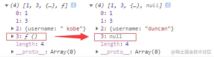

# 浅拷贝与深拷贝

::: tip 参考

[浅拷贝与深拷贝 - 掘金 (juejin.cn)](https://juejin.cn/post/6844904197595332622)

:::

1. 什么是深/浅拷贝，他们跟赋值有何区别？
2. 深/浅拷贝的实现方式有几种？

## 1、浅拷贝与深拷贝

- **浅拷贝**是创建一个新对象，这个对象有着原始对象属性值的一份精确拷贝。如果属性是基本类型，拷贝的就是基本类型的值，如果属性是引用类型，拷贝的就是内存地址 ，所以**如果其中一个对象改变了这个地址，就会影响到另一个对象**。
- **深拷贝**是将一个对象从内存中完整的拷贝一份出来，从堆内存中开辟一个新的区域存放新对象,且**修改新对象不会影响原对象**。

```js
var a1 = {
    b: {
        c: {}
    }
};

var a2 = shallowClone(a1); // 浅拷贝方法
a2.b.c === a1.b.c // true 新旧对象还是共享同一块内存

var a3 = deepClone(a3); // 深拷贝方法
a3.b.c === a1.b.c // false 新对象跟原对象不共享内存
```

## 2、赋值和深/浅拷贝的区别

这三者的区别如下，不过比较的前提都是**针对对象**：

- 当我们把一个对象**赋值**给一个新的变量时，**赋的其实是该对象的在栈中的地址，而不是堆中的数据**。也就是两个对象指向的是同一个存储空间，无论哪个对象发生改变，其实都是改变的存储空间的内容，因此，两个对象是联动的。
- **浅拷贝**：重新在堆中创建内存，拷贝前后对象的基本数据类型互不影响，但拷贝前后对象的引用类型因共享同一块内存，会相互影响。
- **深拷贝**：从堆内存中开辟一个新的区域存放新对象，对对象中的子对象进行递归拷贝,拷贝前后的两个对象互不影响。


## 3、浅拷贝的实现方式

### 3.1 Object.assign()

Object.assign() 方法可以把任意多个的源对象自身的可枚举属性拷贝给目标对象，然后返回目标对象。

```js
let obj1 = { person: {name: "kobe", age: 41},sports:'basketball' };
let obj2 = Object.assign({}, obj1);
obj2.person.name = "wade";
obj2.sports = 'football'
console.log(obj1); // { person: { name: 'wade', age: 41 }, sports: 'basketball' }
```

### 3.2 函数库lodash的_.clone方法

```js
var _ = require('lodash');
var obj1 = {
    a: 1,
    b: { f: { g: 1 } },
    c: [1, 2, 3]
};
var obj2 = _.clone(obj1);
console.log(obj1.b.f === obj2.b.f);// true
```

### 3.3 展开运算符...

```js
let obj1 = { name: 'Kobe', address:{x:100,y:100}}
let obj2= {... obj1}
obj1.address.x = 200;
obj1.name = 'wade'
console.log('obj2',obj2) // obj2 { name: 'Kobe', address: { x: 200, y: 100 } }
```

### 3.4 Array.prototype.concat()

**`concat()`** 方法用于合并两个或多个数组。此方法不会更改现有数组，而是返回一个新数组。

```js
let arr = [1, 3, {
    username: 'kobe'
    }];
let arr2 = arr.concat();    
arr2[2].username = 'wade';
console.log(arr); //[ 1, 3, { username: 'wade' } ]
```

### 3.5 Array.prototype.slice()

**`slice()`** 方法返回一个新的数组对象，这一对象是一个由 `start` 和 `end` 决定的原数组的**浅拷贝**（包括 `start`，不包括 `end`），其中 `start` 和 `end` 代表了数组元素的索引。原始数组不会被改变。

```js
let arr = [1, 3, {
    username: ' kobe'
    }];
let arr3 = arr.slice();
arr3[2].username = 'wade'
console.log(arr); // [ 1, 3, { username: 'wade' } ]
```

## 4、深拷贝的实现方式

### 4.1 JSON.parse(JSON.stringify())

```js
let arr = [1, 3, {username: ' kobe'},function(){}];
let arr4 = JSON.parse(JSON.stringify(arr));
```

**这种方法虽然可以实现数组或对象深拷贝,但不能处理函数和正则**，因为这两者基于`JSON.stringify`和`JSON.parse`处理后，得到的正则就不再是正则（变为空对象），得到的函数就不再是函数（变为null）了。



### 4.2 函数库lodash的_.cloneDeep方法

```js
var _ = require('lodash');
var obj1 = {
    a: 1,
    b: { f: { g: 1 } },
    c: [1, 2, 3]
};
var obj2 = _.cloneDeep(obj1);
console.log(obj1.b.f === obj2.b.f);// false
```

### 4.3 jQuery.extend()方法

```js
var $ = require('jquery');
var obj1 = {
    a: 1,
    b: { f: { g: 1 } },
    c: [1, 2, 3]
};
var obj2 = $.extend(true, {}, obj1);
console.log(obj1.b.f === obj2.b.f); // false
```

### 4.4 手写递归方法

[如何写出一个惊艳面试官的深拷贝?](https://link.juejin.cn/?target=https%3A%2F%2Fsegmentfault.com%2Fa%2F1190000020255831)

```js
function deepClone(obj, hash = new WeakMap()) {
  if (obj === null) return obj; // 如果是null或者undefined我就不进行拷贝操作
  if (obj instanceof Date) return new Date(obj);
  if (obj instanceof RegExp) return new RegExp(obj);
  // 可能是对象或者普通的值  如果是函数的话是不需要深拷贝
  if (typeof obj !== "object") return obj;
  // 是对象的话就要进行深拷贝
  if (hash.get(obj)) return hash.get(obj);
  let cloneObj = new obj.constructor();
  // 找到的是所属类原型上的constructor,而原型上的 constructor指向的是当前类本身
  hash.set(obj, cloneObj);
  for (let key in obj) {
    if (obj.hasOwnProperty(key)) {
      // 实现一个递归拷贝
      cloneObj[key] = deepClone(obj[key], hash);
    }
  }
  return cloneObj;
}
let obj = { name: 1, address: { x: 100 } };
obj.o = obj; // 对象存在循环引用的情况
let d = deepClone(obj);
obj.address.x = 200;
console.log(d);
```

