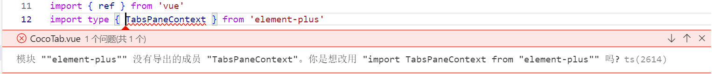

# CocoTab

## 页面结构

```vue
<el-tabs v-model="activeName" class="demo-tabs" @tab-click="handleClick" >
    <el-tab-pane label="网址导航" name="WebNav">
        <WebNav></WebNav>
    </el-tab-pane>
    <el-tab-pane label="每日计划" name="schedule">Config</el-tab-pane>
    <el-tab-pane label="一些碎片" name="notion">Role</el-tab-pane>
</el-tabs>
```

- 设置默认显示`WebNav`：`const activeName = ref('WebNav')`


页面样式


## 报错



**参考：**[模块 ""element-plus"" 没有导出的成员 "ElMessage"。你是想改用 "import ElMessage from "element-plus"" 吗? - 默卿 - 博客园 (cnblogs.com)](https://www.cnblogs.com/sunshine-wy/p/17381028.html)

```tsx
//tsconfig.json
"moduleResolution": "Bundler",  //改为Node
```

在 TypeScript 中，`moduleResolution` 配置选项用于指定模块解析策略，即指定 TypeScript 编译器如何解析模块导入的路径。