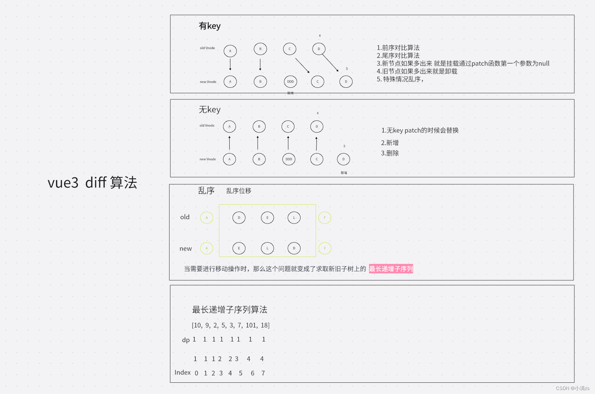

# 虚拟DOM和 diff 算法
## **AST简介**

**抽象语法树（Abstract Syntax Tree，AST）**，或简称语法树（Syntax tree），是源代码语法架构的一种抽象表示。它以树状的形式表现编程语言的语法结构，树上的每个节点都表示源代码中的一种结构。

[学习抽象语法树 AST - 知乎 (zhihu.com)](https://zhuanlan.zhihu.com/p/367990285)

## **什么是虚拟DOM**

[什么是虚拟DOM - 掘金 (juejin.cn)](https://juejin.cn/post/7207250137466781751)

虚拟 DOM（Virtual DOM）是一种轻量级的 JavaScript 对象，它描述了真实 DOM 中的节点信息和属性。虚拟 DOM 可以在**内存**中进行操作，然后通过算法比较新旧虚拟 DOM 的差异，最终**只对发生变化的部分进行 DOM 操作**，从而提高了性能。

虚拟 DOM 的实现源码在 Vue.js 的核心代码中，具体实现位于 `src/core/vdom` 目录下。

其中，`VNode` 类定义了虚拟 DOM 的基本结构，每个 `VNode` 对象表示一个真实 DOM 节点的信息，包括节点类型、属性、子节点等。`createElm` 函数用于创建真实 DOM 节点，并将其插入到父节点中。`patch` 函数是虚拟 DOM 的核心算法，它比较新旧两个 `VNode` 对象的差异，生成一个补丁（Patch），并将这个补丁应用到真实 DOM 中。

下面是一个简化版的 `VNode` 类和 `patch` 函数的示例代码：

```javascript
// VNode 类定义虚拟 DOM 的结构
class VNode {
  constructor(tag, data, children) {
    this.tag = tag;
    this.data = data;
    this.children = children;
  }
}
​
// patch 函数比较新旧 VNode 对象的差异，并生成补丁
function patch(oldVNode, newVNode) {
  if (oldVNode === newVNode) {
    return; // 新旧 VNode 对象相同，无需更新
  }
​
  if (oldVNode.tag !== newVNode.tag) {
    // 新旧 VNode 对象的标签不同，直接替换
    replaceNode(oldVNode, newVNode);
  } else if (oldVNode.text !== newVNode.text) {
    // 新旧 VNode 对象的文本内容不同，更新文本
    updateText(oldVNode, newVNode);
  } else {
    // 新旧 VNode 对象的标签相同，比较属性和子节点
    updateAttrs(oldVNode, newVNode);
    updateChildren(oldVNode, newVNode);
  }
}
​
// 示例用的辅助函数
function replaceNode(oldVNode, newVNode) { /*...*/ }
function updateText(oldVNode, newVNode) { /*...*/ }
function updateAttrs(oldVNode, newVNode) { /*...*/ }
function updateChildren(oldVNode, newVNode) { /*...*/ }
```


[什么是虚拟DOM - 掘金 (juejin.cn)](https://juejin.cn/post/7207250137466781751)

## **没有Key的Diff算法和有key的Diff算法**

