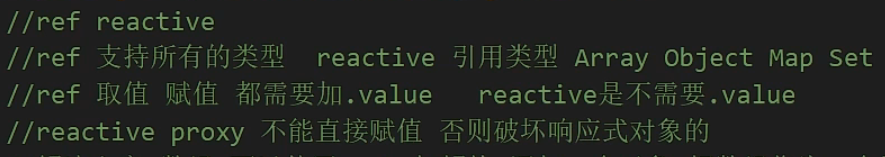

# Reactive全家桶

## 1. **reactive**



用来绑定复杂的数据类型 例如 对象 数组

```js
import { reactive} from 'vue'
 
let person = reactive('sad')	//1、报错

let person = reactive({			//2、正常显示
   name:"小满"
})
person.name = "大满"


let person = reactive<number[]>([])	
setTimeout(() => {	
  person = [1, 2, 3]			//3、不能直接赋值给变量，页面不会响应
  console.log(person);
  
},1000)

//解决方案1：使用push
let person = reactive<number[]>([])
setTimeout(() => {
  const arr = [1, 2, 3]
  person.push(...arr)
  console.log(person);
  
},1000)

//解决方案2：包裹一层对象
type Person = {
  list?:Array<number>
}
let person = reactive<Person>({
   list:[]
})
setTimeout(() => {
  const arr = [1, 2, 3]
  person.list = arr;
  console.log(person);
  
},1000)
```

## 2. **shallowReactive**

只能对浅层的数据 如果是深层的数据只会改变值 不会改变视图

```js
<template>
  <div>
    <div>{{ state }}</div>
    <button @click="change1">test1</button>
    <button @click="change2">test2</button>
  </div>
</template> 
 
<script setup lang="ts">
import { shallowReactive } from 'vue'
 
const obj = {
  a: 1,
  first: {
    b: 2,
    second: {
      c: 3
    }
  }
}
 
const state = shallowReactive(obj)
 
function change1() {
  state.a = 7				//会响应
}
function change2() {		//不会响应
  state.first.b = 8			
  state.first.second.c = 9
  console.log(state);
} 
</script>  

```
