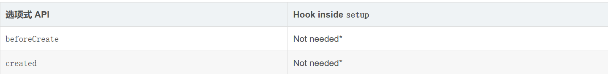

# Vue3生命周期



`beforeCreate`、`created`被替换成了`setup`

```js
onBeforeMount()
//在组件DOM实际渲染安装之前调用。在这一步中，根元素还不存在。

onMounted()
//在组件的第一次渲染后调用，该元素现在可用，允许直接DOM访问

onBeforeUpdate()
//数据更新时调用，发生在虚拟 DOM 打补丁之前。

onUpdated()
//DOM更新后，updated的方法即会调用。

onBeforeUnmount()
//在卸载组件实例之前调用。在这个阶段，实例仍然是完全正常的。

onUnmounted()
//卸载组件实例后调用。调用此钩子时，组件实例的所有指令都被解除绑定，所有事件侦听器都被移除，所有子组件实例被卸载。
```


