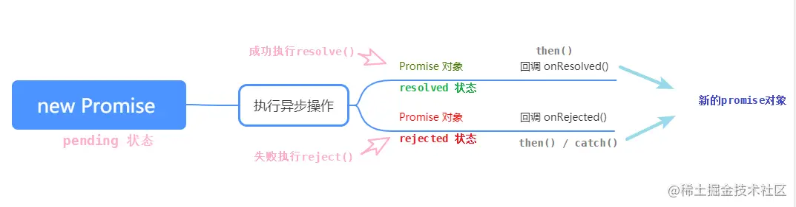

# 异步组件&代码分包&suspense

## 异步组件

在大型应用中，我们可能需要将应用分割成小一些的代码块 并且**减少主包的体积**，这时候就可以使用异步组件


## Promise

[Promise简述与用法 - 掘金 (juejin.cn)](https://juejin.cn/post/7067851523035758600)

[这一次，彻底弄懂 Promise 原理 - 掘金 (juejin.cn)](https://juejin.cn/post/6844904063570542599)

### 什么是Promise



**Promise是JS中进行异步编程的新的解决方案**

- `promise` 是一个**构造函数**
- `Promise` 的构造函数接收一个函数为参数，并且传入两个参数：**resolve，reject**，分别表示**异步操作**执行**成功**后的回调函数和异步操作执行**失败**后的回调函数。

### 为什么要用Promise

1. 指定回调函数的方法更加灵活
2. 支持**链式调用** ，可以解决回调函数问题

### `Promise.prototype.then` 方法

说明：`.then() `方法用来**预先指定成功和失败的回调函数**，调用 `.then() `方法时，成功的回调函数是**必选**的，失败的回调函数是**可选**的

**返回一个新的 promise 对象**

```javascript
Promise.prototype.then(onResolved, onRejected) => {}
onResolved 函数: 成功的回调函数 (value) => {} 	//必选
onRejected 函数: 失败的回调函数 (reason) => {} 	//可选
```

### `Promise.resolve()`

1. **什么是resolve函数?**

   - 它是`Promise`对象的成功回调函数，当`Promise`对象内部状态变为成功时，会调用`resolve`函数.

   - `resolve`函数传入一个参数,该参数可以是任何值,通常是表示完成成功当前任务的**结果**。
   - `resolve`函数返回一个`Promise`对象,表示其内部操作已经成功完成。

2. **resolve函数的作用**
   `resolve`函数的作用是解决异步任务，使异步操作变为有序的。它的出现,使得我们在处理复杂的异步操作时,可以通过控制`resolve`函数的执行顺序，实现顺序操作流程的效果。正是由于有了resolve函数，我们可以非常容易地处理复杂的异步任务。
3. **resolve函数的特性**
   - `resolve`函数是可以接收任何类型的参数，并且可以将任意类型的参数作为`Promise`对象的结果传递给`then`回调函数。
   - `resolve`函数可以将异步操作转化为有序的流程，只要通过控制`resolve`函数的执行顺序就可以处理复杂的异步操作。
   - `resolve`函数是单线程的,不会同时执行多个`resolve`函数，只有当前的`resolve`函数执行完毕，才能执行下一个`resolve`函数。


## 原生Ajax封装axios

```tsx
export const axios = {
	get <T>(url:string):Promise<T>{
        return new Promise((resolve)=>{
            const xhr = new XMLHttpRequest()
            xhr.open('GET',url)				//创建http请求
            
            xhr.onreadystatechange = ()=>{	//请求状态改变的事件触发器（readyState变化时会调用此方法）
                if(xhr.readystate == 4 && xhr.status == 200){
                    //模拟网络延迟
                    setTimeout(()=>{		
                        resolve(JSON.parse(xhr.responseText))
                    },2000)
                }
            }
            
            xhr.send(null)					//发送请求给服务器
        })
    }
}
```


## 顶层 `await`

[20. async 函数 - 顶层 await - 《阮一峰 ECMAScript 6 (ES6) 标准入门教程 第三版》 - 书栈网 · BookStack](https://www.bookstack.cn/read/es6-3rd/spilt.7.docs-async.md)

根据语法规格，`await`命令只能出现在 `async` 函数内部，否则都会报错。

```js
// 报错
const data = await fetch('https://api.example.com');
```

目前，有一个**语法提案**，允许在模块的顶层独立使用`await`命令，使得上面那行代码不会报错了。这个提案的目的，是借用`await`解决模**块异步加载**的问题。

```js
// awaiting.js
let output;
(async function1 main() {
  const dynamic = await import(someMission);
  const data = await fetch(url);
  output = someProcess(dynamic.default, data);
})();
export { output };
```

我们把异步操作包装在一个 `async` 函数里面，只有等里面的异步操作都执行，变量 `output` 才会有值，否则就返回  `undefined`

那么其他模块引入`output`时就可能获得`undefined`导致**报错**，模块的使用者需要知道依赖模块的内部有没有异步操作破坏了封装性。

为了解决这个问题，引入**顶层`await`**：

```js
// awaiting.js
const dynamic = import(someMission);
const data = fetch(url);
export const output = someProcess((await dynamic).default, await data);
```

上面代码中，两个异步操作在输出的时候，都加上了`await`命令。只有等到异步操作完成，这个模块才会输出值。

模块的使用者完全不用关心，依赖模块的内部有没有异步操作，正常加载即可。


## suspense

### 子组件

在组件内部使用了**顶层 `await`**技术，组件变为**异步组件**

```vue
<template>
    <div>{{data.name}}</div>
</template>
<script>
    const {data} = await axios get<Data>(url)
</script>
```

### 父组件

- **异步组件的引入方式**(两种)

```tsx
import {defineAsyncComponent} from 'vue'
const SyncVue = defineAsyncComponent(()=> 	import('@/component/sync.vue'))		//第一种
const SyncVue = defineAsyncComponent({//第二种
    loadingCompnent:()=> import('@/component/sync.vue'),
    errorComponent：,
    timeout:
})
```

- **异步组件的使用方式**

```vue
<template>
	<Suspense>					//<Suspense>默认提供两个插槽
        
        <template #defalut>		//异步组件加载成功时显示
            <SyncVue></SyncVue>	
		</template>

        <template #fallback>	// 异步组件未加载成功时显示
			<skeletonVue></skeletonVue>
		</template>
    </Suspense>
</template>
```

`<skeletonVue>`是**骨架屏**

**骨架屏的作用主要是在网络请求较慢时，提供基础占位，当数据加载完成，恢复数据展示。这样给用户一种很自然的过渡，不会造成页面长时间白屏或者闪烁等情况。 常见的骨架屏实现方案有`ssr`服务端渲染和`prerender`两种解决方案。**

[Vue中实现骨架屏的多种方式 - 白不了的黑发 - 博客园 (cnblogs.com)](https://www.cnblogs.com/bbldhf/p/14091594.html)


## 代码分包

**默认情况下，vite会把所有东西放到一个js里面**

**而使用异步组件方式，vite会把异步组件单独打包成一个js文件**，只有等用到这个js时才会去做一个加载，大大减少首页白屏时间

所以可以使用异步组件技术去优化我们的项目

